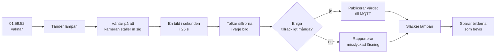

# vatten_kamera

Läser av pumpdisplayen i källaren efter kl. 02:00 och skickar värdet till Home Assistant.

Displayen visar **liter kvar innan spolning** som ett tal med två decimaler, t.ex. `1.22`
eller `0.50`. Värdet syns bara i **10–12 sekunder** strax efter 02:00. Därför räcker det
inte att ta en bild: programmet tänder lampan i tid, tar en bild i sekunden genom hela
fönstret och låter en majoritetsröstning avgöra värdet.



## Så här fungerar avläsningen

Displayen har sjusegmentsiffror (som en digitalklocka). I stället för vanlig OCR mäter
programmet hur mycket **varje enskilt segment lyser** och jämför med de kända mönstren för
0–9. Det är betydligt tåligare mot suddiga bilder och kräver inga externa program.

Några saker som gör läsningen tillförlitlig:

| Problem | Lösning |
|---|---|
| Siffrorna är bara några tiotal pixlar höga | Cellerna hittas automatiskt och rutnätet passas in med en sökning |
| En **etta** lyser bara i cellens högra halva | Rutnätets läge söks av, det antas inte vara jämnt fördelat |
| En **nolla** kan klyvas och se ut som två ettor | Rutnät som skär genom tända segment straffas |
| Pumphuset är ljust och stort | Ytor över 30 % av utsnittet förkastas, siffrorna är små |
| En jämngrå yta kan se ut som "alla segment lyser" | Cellen kräver kontrast, annars rapporteras inget värde |
| Reflektionen i displayglaset | Klipps bort med `CLIP_BOTTOM`, eller undviks genom att tippa kameran |

## Installation

```powershell
git clone <repo> C:\vatten_kamera
cd C:\vatten_kamera
python -m venv .venv
.venv\Scripts\python.exe -m pip install -r requirements.txt
copy .env.example .env
notepad .env      # fyll i kamerans lösenord, HA-token och MQTT
```

Testa att kameran svarar:

```powershell
run.cmd main.py probe
```

`run.cmd` är en liten genväg som kör projektets egen Python. Alla kommandon nedan kan
skrivas `run.cmd main.py ...` i stället för `python main.py ...`.

## Kameran – placering och ljus

Det här är den enskilt viktigaste faktorn för att läsningen ska bli pålitlig.

* **Placera kameran 25–40 cm från displayen, rakt framifrån.** Snedbild trycker ihop
  siffrorna och ger perspektivfel.
* **Sifferraden bör vara minst ~300 px bred** i den 2048 px breda bilden. Det ger ca
  4 px per segment, vilket är nedre gränsen för att segmenten ska gå att skilja.
  Är displayen mindre i bilden än så blir läsningen osäker.
* **Tippa kameran 5–10°** så att du inte ser displayglaset rakt i reflex — annars
  speglas siffrorna som en spegelvänd dubblett under originalet.
* **Lampan ska lysa displayen, inte in i objektivet.** Sätt den vid sidan/ovanifrån.
  Bländar lampan kameran bränns siffrorna ut helt.

## Kalibrering

Kalibreringen talar om var i bilden siffrorna sitter. Den behöver bara göras om när
kameran flyttats.

1. **Titta på ett utsnitt:**

   ```powershell
   run.cmd main.py peek
   ```

   Öppna `captures/peek.png`. Flytta `CALIBRATION_ROI` i `.env` och kör igen tills
   utsnittet sitter runt siffrorna. `captures/last_snapshot.jpg` visar hela bilden.

2. **Låt programmet hitta rutnätet:**

   ```powershell
   run.cmd main.py calibrate --save
   ```

   Du får ut vad displayen läses som just nu, konfidens per siffra och vilka segment som
   lyser. Kontrollera `captures/calibrate_*_roi.png` — de gröna rutorna ska sitta runt
   varsin siffra och de röda runt hela sifferraden.

3. **Kontrollera läsningen över tid:**

   ```powershell
   run.cmd main.py read --seconds 20        # läs nu
   run.cmd main.py watch --minutes 2        # visa displayen live som text
   ```

Glöm inte `DIGIT_COUNT` i `.env` om displayen har annat antal siffror än fyra.

## Vanliga kommandon

| Kommando | Vad det gör |
|---|---|
| `main.py version` | Visar version och aktuell konfiguration |
| `main.py probe` | Testar att kameran svarar och sparar en bild |
| `main.py peek` | Sparar ett förstorat utsnitt av displayen |
| `main.py calibrate --save` | Hittar och sparar sifferrutnätet |
| `main.py read --seconds 20` | Läser displayen nu |
| `main.py watch` | Följer displayen live som text i terminalen |
| `main.py lamp on\|off\|state` | Testar lampan via Home Assistant |
| `main.py image show\|set\|tune\|restore` | Kamerans bildinställningar |
| `main.py mqtt-test --value 1050` | Publicerar ett provvärde så sensorerna dyker upp i HA |
| `main.py run` | En komplett körning direkt (lampa, läsning, publicering) |
| `main.py daemon` | Väntar in klockslaget och kör varje natt |

## Inställningar i `.env`

| Inställning | Standard | Beskrivning |
|---|---|---|
| `CAMERA_IP`, `CAMERA_USER`, `CAMERA_PASSWORD` | – | Kameran. Använder Basic auth mot ISAPI |
| `CAMERA_CHANNEL` | `101` | 101 = huvudström, 102 = subström |
| `CALIBRATION_ROI` | – | Utsnittet där displayen sitter, `x1,y1,x2,y2` |
| `DIGIT_COUNT` | `4` | Antal siffror på displayen (punkten räknas inte) |
| `DECIMALS` | `0` | Antal decimaler i värdet. Visas `1.22` är det 2 |
| `REQUIRE_ALL_DIGITS` | `true` | Kräv att alla siffror lyser — en släckt siffra betyder felläsning |
| `COLOR_CHANNEL` | `auto` | `b` för röd LED: siffrorna lyser men den röda glöden blir svart |
| `THRESHOLD` | `0` | Fast tröskel 0–255. Hög tröskel håller spegelbilden i glaset borta |
| `UNIT` | tom | Enhet vid sensorn i HA, t.ex. `m3` eller `l` |
| `RUN_AT` | `02:00:00` | Klockslaget värdet visas |
| `WINDOW_S` | `25` | Hur länge vi läser |
| `INTERVAL_S` | `1.0` | Tid mellan bilderna |
| `PRE_START_S` | `8` | Hur långt innan körningen startar |
| `MIN_AGREEMENT` | `3` | Antal bilder som måste vara eniga |
| `MIN_CONFIDENCE` | `0.75` | Minsta konfidens per siffra |
| `HA_BASE_URL`, `HA_TOKEN` | – | Home Assistant |
| `HA_LIGHT_ENTITY` | tom | Lampan vid pumpen. **Tom = ingen lampstyrning** |
| `MQTT_HOST`, `MQTT_PORT` | – | MQTT-broker |
| `CLIP_BOTTOM` | `0.0` | Andel av utsnittets höjd som klipps bort nedtill (reflektionen) |
| `SAVE_FRAMES` | `true` | Sparar bilderna från varje körning |

## Entiteter i Home Assistant

Sensorerna skapas automatiskt via MQTT-discovery och dyker upp under enheten
**Vattenkamera (pumpen)**:

| Entitet | Betydelse |
|---|---|
| `sensor.vatten_kamera_varde` | Värdet. Attribut: `raw_text`, `confidence`, `röster`, `read_at`, `bild` |
| `binary_sensor.vatten_kamera_lasning_ok` | Om senaste läsningen lyckades |

Testa utan att vänta till 02:00:

```powershell
run.cmd main.py mqtt-test --value 1050
```

### Lampan

Displayen är en **självlysande röd LED** och läses lika bra i mörker — lampan behövs
alltså inte för att siffrorna ska synas. Den gör ändå nytta: mer ljus ger kortare
slutartid och mindre brus i bilden, vilket ger säkrare tolkning.

Lampan är inte installerad än. När den är på plats:

1. Sätt `HA_LIGHT_ENTITY=light.din_lampa` i `.env`.
2. Testa med `run.cmd main.py lamp on` och `run.cmd main.py lamp off`.

Är `HA_LIGHT_ENTITY` tom körs allt annat som vanligt, men utan belysning.

## Kamerans bildinställningar

Bilden avgör om läsningen lyckas, och kameran har flera inställningar som spelar stor roll.
Allt kan läsas, ändras och återställas från kommandoraden:

```powershell
run.cmd main.py image show                    # visa alla inställningar
run.cmd main.py image set gain=20 shutter=1/100
run.cmd main.py image tune                    # prova olika exponeringar och välj den bästa
run.cmd main.py image restore                 # gå tillbaka till utgångsläget
```

En backup av utgångsläget sparas automatiskt i `camera_settings_backup.json` första gången
något ändras, så `image restore` kan alltid ta dig tillbaka.

### Tre fynd som gjorde skillnad

| Vad | Varför det spelar roll |
|---|---|
| **Dagsläge (`ircut=day`) i stället för nattläge** | Displayen är en röd LED. I svartvitt nattläge brände den ut till en vit klump utan igenkännbara segment. |
| **Läs blåkanalen, inte gråskala** | Rött ljus har inget blått. I blåkanalen lyser siffrorna medan den röda glöden runt dem blir svart — det ger en ren, skarp bild. Sätts med `COLOR_CHANNEL=b`. |
| **Hög tröskel (`THRESHOLD=215`)** | Siffrorna är mättade medan spegelbilden i displayglaset är svag. Tröskeln håller spegelbilden borta så att sifferbandet inte blir för högt. |

### Se vad avläsaren ser

```powershell
run.cmd main.py peek --scale 8 --nearest      # råa pixlar, ingen utjämning
```

Kommandot skriver också ut vilken färgkanal avläsaren valde och sparar
`captures/peek_channel.png` — exakt den bild tolkningen utgår ifrån.

## Kända begränsningar

* Avläsaren är en heuristik. Ett testfall är markerat `xfail`: en ljus ram som rör vid
  ROI:ts kanter kan förskjuta rutnätet. Håll därför ROI:t tätt runt siffrorna.
* Ligger sifferraden under ~120 px bred i bilden blir läsningen osäker. Se
  avsnittet om kamerans placering ovan.

## Drift på servern

Kör som en tjänst eller schemalagd uppgift som startar ett program och håller det igång:

```powershell
cd C:\vatten_kamera
.venv\Scripts\python.exe main.py daemon
```

`daemon` räknar själv ut nästa gång klockslaget inträffar, sover, kör och börjar om.
Vid fel skrivs allt till loggen och — om `NOTIFY_ON_FAILURE=true` — en notis skickas till
Home Assistant.

Varje körning sparas i `captures/runs/<datum>/` med bilderna och en `summary.json`,
så det går att gå tillbaka och se exakt vad kameran såg den natten.

## Felsökning

| Symptom | Trolig orsak |
|---|---|
| `HTTP 401` vid snapshot | Fel lösenord, eller Digest används i stället för Basic |
| `inget varde kunde lasas` | Utsnittet sitter fel — kör `peek` och justera `CALIBRATION_ROI` |
| Värdet blir fel siffra | Kameran står snett eller för långt bort, eller reflektionen stör |
| Låg konfidens | För lite ljus, eller siffrorna för små i bilden |
| Lampan tänds inte | `HA_LIGHT_ENTITY` fel eller `HA_TOKEN` ogiltig — kör `main.py lamp state` |
| Inga entiteter i HA | `MQTT_HOST` fel — kör `main.py mqtt-test` |

En bra första åtgärd vid alla läsproblem:

```powershell
run.cmd tools/debug_grid.py --image captures/last_snapshot.jpg --roi <x1,y1,x2,y2> --digits 4
```

Den visar bandet, varje cells segmentvärden och vilken siffra cellen tolkades som.

## Utveckling

```powershell
run.cmd -m pytest tests -q
```

Testerna kör mot syntetiskt ritade sjusegmentsiffror, så de verifierar avläsningen utan
att kameran behöver vara inkopplad. De täcker suddiga bilder, brus, svagt ljus, enbart
ettor, ljusa kanter och jämna ytor.

Versionen finns i `config.py` (`VERSION`) och visas av `main.py version`. Den bumpas vid
varje ändring så att det går att se vilken version som kör på servern.
