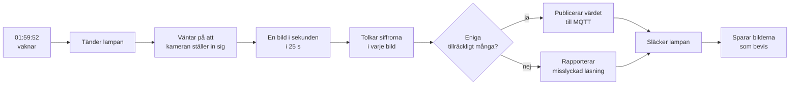

# vatten_kamera

Läser av pumpdisplayen i källaren efter kl. 02:00 och skickar värdet till Home Assistant.

Displayen visar **liter kvar innan spolning** som ett tal med två decimaler, t.ex. `1.22`
eller `0.50`. Värdet syns bara i **10–12 sekunder** strax efter 02:00. Därför räcker det
inte att ta en bild: programmet tänder lampan i tid, tar en bild i sekunden genom hela
fönstret och låter en majoritetsröstning avgöra värdet.



## Så här fungerar avläsningen

Displayen har sjusegmentsiffror (som en digitalklocka). I stället för vanlig OCR mäter
programmet hur mycket **varje enskilt segment lyser** och jämför med de kända mönstren för
0–9. Det är betydligt tåligare mot suddiga bilder och kräver inga externa program.

Några saker som gör läsningen tillförlitlig:

| Problem | Lösning |
|---|---|
| Kameran ser panelen snett, så **sifferraden lutar** — sista siffran sitter ~35 px lägre i bilden än den första | Varje sifferposition mäts för sig, både i x och i y. Ett rutnät på gemensam höjd lägger mätfönstren fel på de högra siffrorna |
| En **nolla** läses som en åtta | Mittensegmentet avgörs av om **hålet** i nollan är fyllt, inte av ljusnivån — glöden kring segmenten varierar mellan bilderna |
| En **etta** lyser bara i cellens högra halva | Cellens bredd tas från de positioner som visar en hel siffra, och cellen högerställs mot den uppmätta klumpen |
| Glöden runt siffrorna och **kolonets** glöd smetar in i granncellen | Mätfönstren ligger innanför cellkanten, inte ut mot den |
| Pumphuset är ljust och stort | Ytor över 30 % av utsnittet förkastas, siffrorna är små |
| En jämngrå yta kan se ut som "alla segment lyser" | Cellen kräver kontrast, annars rapporteras inget värde |
| Reflektionen i displayglaset | Klipps bort med `CLIP_BOTTOM`, eller undviks genom att tippa kameran |

## Installation

```powershell
git clone <repo> C:\vatten_kamera
cd C:\vatten_kamera
python -m venv .venv
.venv\Scripts\python.exe -m pip install -r requirements.txt
copy .env.example .env
notepad .env      # fyll i kamerans lösenord, HA-token och MQTT
```

Testa att kameran svarar:

```powershell
run.cmd main.py probe
```

`run.cmd` är en liten genväg som kör projektets egen Python. Alla kommandon nedan kan
skrivas `run.cmd main.py ...` i stället för `python main.py ...`.

## Kameran – placering och ljus

Det här är den enskilt viktigaste faktorn för att läsningen ska bli pålitlig.

* **Placera kameran 25–40 cm från displayen.** Snedbild trycker ihop siffrorna, men
  snedbild är också vad kameran ser när den sitter som den gör — sifferraden lutar då
  ~35 px över hela raden. Programmet mäter varje position för sig och klarar det.
* **Sifferraden bör vara minst ~60 px per siffra** i den 2048 px breda bilden. Kameran
  står nu så att siffrorna är ~95–100 px breda. Kör `run.cmd main.py diagnose` — den
  säger till om det räcker.
* **Hela raden måste rymmas i `CALIBRATION_ROI`.** Klipper utsnittet första eller sista
  siffran blir cellen för liten och förskjuten; `main.py calibrate` varnar om det.
* **Kameran måste sitta fast.** Vibrationer och att någon stöter till den flyttar
  mätfönstren. Flyttas kameran: mät om med `main.py calibrate --frames 16 --save`.
* **Sätt displayen i bildens mitt.** Billiga kameror är påtagligt suddigare i
  hörnen, och displayen hamnar lätt där annars.
* **Tippa kameran 5–10°** så att du inte ser displayglaset rakt i reflex — annars
  speglas siffrorna som en spegelvänd dubblett.
* **Lampan ska lysa displayen, inte in i objektivet.** Sätt den vid sidan/ovanifrån.

## Kalibrering

Kalibreringen talar om var i bilden siffrorna sitter. Den behöver göras om när kameran
flyttats — även några centimeter märks, för då flyttar mätfönstren.

1. **Titta på ett utsnitt:**

   ```powershell
   run.cmd main.py peek
   ```

   Öppna `captures/peek.png`. Flytta `CALIBRATION_ROI` i `.env` och kör igen tills
   utsnittet rymmer **hela** sifferraden med marginal — annars klipps första eller sista
   siffran och då blir dess mätfönster fel. `captures/last_snapshot.jpg` visar hela bilden.

2. **Mät sifferpositionerna:**

   ```powershell
   run.cmd main.py calibrate --frames 16 --save
   ```

   Sexton bilder behövs: displayen växlar mellan klockan, spoltiden och värdena, och
   tillsammans visar bilderna alla fyra positionerna. Kommandot skriver ut var varje
   position sitter och hur den läses just nu.

   Kontrollera `captures/calibrate_*_segments.png`: där ligger de sju mätfönstren per
   siffra ovanpå tidsstacken. **Grön ruta = avläsaren tycker att segmentet lyser.** Sitter
   rutorna på segmenten är geometrin rätt; hamnar de bredvid syns det direkt.

3. **Kontrollera läsningen mot verkliga bilder:**

   ```powershell
   run.cmd tools/grab.py --frames 16 --out captures/s2
   run.cmd tools/fit_cells.py captures/s2 --read
   ```

   Den skriver ut vad varje bild lästes som. Displayen växlar vy hela tiden, så det är
   normalt att raderna visar olika tal — men de ska vara *rimliga*: klockan som ett
   klockslag, spoltiden som `02:00`, och värdena som tresiffriga tal (t.ex. `010` = 0.10).

4. **Kontrollera över tid:**

   ```powershell
   run.cmd main.py read --seconds 20        # läs nu
   run.cmd main.py watch --minutes 2        # visa displayen live som text
   ```

Glöm inte `DIGIT_COUNT` i `.env` om displayen har annat antal siffror än fyra.

## Vanliga kommandon

| Kommando | Vad det gör |
|---|---|
| `main.py version` | Visar version och aktuell konfiguration |
| `main.py probe` | Testar att kameran svarar och sparar en bild |
| `main.py peek` | Sparar ett förstorat utsnitt av displayen |
| `main.py calibrate --frames 16 --save` | Mäter och sparar sifferpositionerna |
| `main.py read --seconds 20` | Läser displayen nu |
| `main.py watch` | Följer displayen live som text i terminalen |
| `main.py lamp on\|off\|state` | Testar lampan via Home Assistant |
| `main.py image show\|set\|tune\|restore` | Kamerans bildinställningar |
| `main.py image save-profile\|show-profile` | Läget kameran lånas till under läsningen |
| `main.py diagnose` | Säger till om kameran står nära nog |
| `main.py mqtt-test --value 1050` | Publicerar ett provvärde så sensorerna dyker upp i HA |
| `main.py run` | En komplett körning direkt (lampa, läsning, publicering) |
| `main.py daemon` | Väntar in klockslaget och kör varje natt |

## Inställningar i `.env`

| Inställning | Standard | Beskrivning |
|---|---|---|
| `CAMERA_IP`, `CAMERA_USER`, `CAMERA_PASSWORD` | – | Kameran. Använder Basic auth mot ISAPI |
| `CAMERA_CHANNEL` | `101` | 101 = huvudström, 102 = subström |
| `CALIBRATION_ROI` | – | Utsnittet där displayen sitter, `x1,y1,x2,y2` |
| `DIGIT_COUNT` | `4` | Antal siffror på displayen (punkten räknas inte) |
| `DECIMALS` | `0` | Antal decimaler i värdet. Visas `1.22` är det 2 |
| `REQUIRE_ALL_DIGITS` | `true` | Kräv att alla siffror lyser — en släckt siffra betyder felläsning |
| `COLOR_CHANNEL` | `auto` | `b` för röd LED: siffrorna lyser men den röda glöden blir svart |
| `THRESHOLD` | `0` | Fast tröskel 0–255. Hög tröskel håller spegelbilden i glaset borta |
| `UNIT` | tom | Enhet vid sensorn i HA, t.ex. `m3` eller `l` |
| `RUN_AT` | `02:00:00` | Klockslaget värdet visas |
| `WINDOW_S` | `25` | Hur länge vi läser |
| `INTERVAL_S` | `1.0` | Tid mellan bilderna |
| `PRE_START_S` | `8` | Hur långt innan körningen startar |
| `MIN_AGREEMENT` | `3` | Antal bilder som måste vara eniga |
| `MIN_CONFIDENCE` | `0.75` | Minsta konfidens per siffra |
| `HA_BASE_URL`, `HA_TOKEN` | – | Home Assistant |
| `HA_LIGHT_ENTITY` | tom | Lampan vid pumpen. **Tom = ingen lampstyrning** |
| `MQTT_HOST`, `MQTT_PORT` | – | MQTT-broker |
| `CLIP_BOTTOM` | `0.0` | Andel av utsnittets höjd som klipps bort nedtill (reflektionen) |
| `SAVE_FRAMES` | `true` | Sparar bilderna från varje körning |

## Entiteter i Home Assistant

Sensorerna skapas automatiskt via MQTT-discovery och dyker upp under enheten
**Vattenkamera (pumpen)**:

| Entitet | Betydelse |
|---|---|
| `sensor.vatten_kamera_varde` | Värdet. Attribut: `raw_text`, `confidence`, `röster`, `read_at`, `bild` |
| `binary_sensor.vatten_kamera_lasning_ok` | Om senaste läsningen lyckades |

Testa utan att vänta till 02:00:

```powershell
run.cmd main.py mqtt-test --value 1050
```

### Lampan

Displayen är en **självlysande röd LED** och läses lika bra i mörker — lampan behövs
alltså inte för att siffrorna ska synas. Den gör ändå nytta: mer ljus ger kortare
slutartid och mindre brus i bilden, vilket ger säkrare tolkning.

Lampan är inte installerad än. När den är på plats:

1. Sätt `HA_LIGHT_ENTITY=light.din_lampa` i `.env`.
2. Testa med `run.cmd main.py lamp on` och `run.cmd main.py lamp off`.

Är `HA_LIGHT_ENTITY` tom körs allt annat som vanligt, men utan belysning.

## Kamerans bildinställningar

Bilden avgör om läsningen lyckas, och kameran har flera inställningar som spelar stor roll.
Allt kan läsas, ändras och återställas från kommandoraden:

```powershell
run.cmd main.py image show                    # visa alla inställningar
run.cmd main.py image set gain=40 shutter=1/50
run.cmd main.py image tune                    # prova olika exponeringar och välj den bästa
run.cmd main.py image restore                 # gå tillbaka till utgångsläget
```

En backup av utgångsläget sparas automatiskt i `camera_settings_backup.json` första gången
något ändras, så `image restore` kan alltid ta dig tillbaka.

### Tre fynd som gjorde skillnad

| Vad | Varför det spelar roll |
|---|---|
| **Dagsläge (`ircut=day`) i stället för nattläge** | Displayen är en röd LED. I svartvitt nattläge brände den ut till en vit klump utan igenkännbara segment. |
| **Läs blåkanalen, inte gråskala** | Rött ljus har inget blått. I blåkanalen lyser siffrorna medan den röda glöden runt dem blir svart — det ger en ren, skarp bild. Sätts med `COLOR_CHANNEL=b`. |
| **Hög tröskel (`THRESHOLD=250`)** | Siffrorna är mättade medan spegelbilden i displayglaset är svag. Tröskeln håller spegelbilden borta så att sifferbandet inte blir för högt. |
| **Mättad exponering, inte "lagom"** | Displayen lyser själv, men i blåkanalen är en röd LED svag — blir siffrorna inte mättade smiter de igenom tröskeln. `main.py image tune` mäter hur långt varje segments ljusnivå ligger från mitten (där tolken inte kan skilja tänt från släckt). Mätt 2026-09-20: **gain 40 + 1/50** gav celler på 95×103 px och värdet `116` med konfidens 0.57–0.62, medan **gain 20 + 1/250** gav en fem gånger mörkare bild där cellerna krympte till 60×88 px och läsningen gav skräp (`1`, `3`, `?4`, `31`). |
| Displayens **nia har ett fullt bottenstreck** | Nian är `a, b, c, d, f, g` och skiljs från en åtta av det **nedre vänstra** segmentet, som är släckt på en nia. Glöden från bottenstrecket och mittstapeln smetar in i det fönstret och lyfter ljusnivån där till ~0.58 — mätt på ljusnivå blev `0.92` därför `0.82`. De tre segment som ligger inklämda mellan tända staplar (mitten, botten och nedre vänster) mäts därför på hur **fyllt** fönstret är, inte på ljusnivå. Då blir nian `9` med konfidens 0.83–0.85. |

### Läsprofilen — kameran lånas bara under läsningen

Kameran används till att se rummet, och i det läget (nattläge med IR och hög
förstärkning) bränner den självlysande displayen ut till en vit klump. Därför har
programmet två separata lägen:

* **Kamerans eget läge** — ditt normala, orört. Det gäller hela dygnet.
* **Läsprofilen** (`camera_profile.json`) — används bara under själva lässekunden.

Kedjan är: spara kamerans läge → byt till läsprofilen → läs → **lägg tillbaka
kamerans läge**. Återställningen ligger i ett `finally`-block, så den sker även om
läsningen kraschar. Kameran lämnas aldrig i ett läge som gör bilden mörk.

```powershell
run.cmd main.py image show-profile                     # visa läget och vad som ändras
run.cmd main.py image save-profile ircut=day gain=20 shutter=1/100
run.cmd main.py image tune                            # hitta bästa exponering
```

`save-profile` rör inte kameran — den skriver bara filen, så du kan bestämma
läget i förväg. Stäng av hela mekanismen med `USE_CAMERA_PROFILE=false`.

### Se vad avläsaren ser

```powershell
run.cmd main.py peek --scale 8 --nearest      # råa pixlar, ingen utjämning
```

Kommandot skriver också ut vilken färgkanal avläsaren valde och sparar
`captures/peek_channel.png` — exakt den bild tolkningen utgår ifrån.

### Displayens siffror är mätta, inte ideala

Mätfönstren i `segments.py` ska inte beskriva ett *idealt* sjusegment utan den här
displayens typsnitt. Fyra saker skiljer sig, och alla är mätta mot riktiga bilder
(2026-09-21):

| Vad displayen gör | Vad det ställde till | Vad som gjordes |
|---|---|---|
| **Fyran** har en höger stapel som når ända upp i överkanten | `a`-fönstret mättes till 1.00 på en fyra. Med ett idealt mönster (a släckt) blev fyran i stället en **nia** — båda hade precis ett fel, felen blev lika stora och konfidensen **0.00** | Mönstret för `4` beskriver displayens fyra (`a, b, c, f, g`). Det som skiljer fyran från nian är **bottenstrecket** |
| **Sexan och femman** har en hake: översta strecket böjer av nedåt i övre högra hörnet | `b` mättes till 0.61 på en sexa. 0.61 ligger närmare 1 än 0, så sexan lästes som en **åtta** | `b` mäts som **fyllnad** (hur stor del av fönstret som är mättat), inte som ljusnivå — haken glöder men fyller inte fönstret |
| **Översta streckets vänstra ände** lutar nedåt i övre vänstra hörnet | `f` mättes till 0.26 på en trea. Trean och nian skiljs *bara* av `f`, så trean blev tvetydig (konfidens 0.33, kravet är 0.35) | `f` mäts också som fyllnad |
| **Bottenstreckets glöd** når upp i nedre vänstra hörnet | `e`-fönstret var fyllt till 43 % på en nia, och nian och åttan kom så nära varandra att nian fick konfidens **0.22** | `e`-fönstret flyttat upp till y 0.58–0.70, där en sexa är mättad och glöden inte når |

Kontrollera mätningen mot riktiga bilder — det är så fönstren ska ändras, inte på
känsla:

```powershell
run.cmd tools/check_digits.py --verbose
```

Verktyget läser 20 sparade bilder där vi vet vad displayen visade (klockan `1709`,
spolttiden `0200`, värdet `064`, flödet `000`, …), jämför siffra för siffra och
skriver ut både vad avläsaren fick och de uppmätta segmentvärdena för varje siffra
som inte nådde 0.5 i konfidens. Just nu: **80 av 80 siffror rätt, ingen under 0.5**.
Lägg till fler bilder i `LABELS` när nya siffror dyker upp på displayen.

## Displayen

Displayen är en **självlysande röd LED med tre siffror**, plus kolon och decimalpunkt.
Kolonet används när den visar sin egen klocka (`5:28`), punkten när den visar ett värde
(`1.22`, `0.50`). Panelens tryckta legend `88.8` visar samma sak: tre siffror med punkt.

Sifferpositionerna mättes upp i en verklig bild:

| Position | x i bilden | y i bilden |
|---|---|---|
| 1 | 1001–1092 | 0–99 |
| 2 | 1116–1211 | 9–108 |
| 3 | 1230–1328 | 21–120 |
| 4 | 1345–1444 | 36–134 |

Raden **lutar** alltså: position 4 sitter ~35 px lägre i bilden än position 1. Det är
därför varje position har sin egen höjd i `calibration.json` — ett rutnät på gemensam
höjd lägger mätfönstren fel på de högra siffrorna. Siffrorna är ~95–100 px breda, alltså
gott om marginal (kravet är minst ~60 px per siffra).

Tabellen ovan gäller kamerans läge 2026-09-20. Flyttas kameran görs en ny mätning med
`main.py calibrate --frames 16 --save`, och då skrivs `calibration.json` om.

Använd `tools/measure_display.py` för att mäta om detta om kameran flyttas:

```powershell
run.cmd tools/measure_display.py captures\last_snapshot.jpg
```

Den skriver ut kolumnprofilen som siffror i stället för att man ska gissa ur en bild.
Det var så sifferantalet fastställdes.

`tools/probe_cell.py` skriver en siffercell som en teckenkarta, så att man ser var
segmenten och hålet i en nolla faktiskt sitter:

```powershell
run.cmd tools/probe_cell.py captures/s2/000_152050.jpg --cell 2
```

Det var så mätfönstren i `segments.py` hamnade rätt.

### Sidvarvet

Displayen växlar mellan fyra sidor, ~14 sekunder var, i den här ordningen:

| Ordning | Sida | Exempel | Känns igen på |
|---|---|---|---|
| 1 | klockan | `20:43` | alla fyra positionerna tända |
| 2 | spolttiden | `02:00` | alla fyra positionerna tända |
| 3 | **värdet** | `0.91` | första positionen släckt |
| 4 | flödet | `0.00` | första positionen släckt |

Värdet och flödet ser **exakt likadana ut** för avläsaren — båda är tre siffror med den
första positionen släckt. Det enda som skiljer dem är ordningen i varvet, och värdet
kommer direkt efter spolttiden. Programmet röstar därför bara på de läsningar som följer
på en spolttidssida. Kommer ingen värdesida efter spolttiden (fönstret tog slut mitt i
varvet) publiceras **inget** värde — hellre det än att `0.00` går ut som om det vore
"liter kvar".

Tidssidorna har alla fyra positionerna tända, så `REQUIRE_BLANK_FIRST` förkastar dem:
klockan `20:43` kan aldrig bli värdet `2.04`.

### Toningar är inte sidor

Sidan letas upp i två steg, och det är skillnaden mellan att tappa värdet och att få det:

1. **Värdet** tas från den första grupp i sidan som vilar på tillräckligt många bilder
   (`PAGE_MIN_FRAMES = 4` i `pipeline.py`). Sidan står stilla i 10–12 s och blir därför
   en enda stor grupp på 14–20 bilder, medan en **toning** mellan två sidor bara ger en
   eller ett par bilder — och en toning kan läsas som ett värde som inte finns på
   displayen.
2. **Alla** läsningar med det värdet får rösta, inte bara den största gruppen.

Båda stegen behövdes. I körningen 21:01 lästes en toning som `0891`; den blev "sidan",
svepet tog slut där, och de 14 bilderna på `0.91` kom aldrig med i röstningen — inget
värde publicerades. I körningen 21:05 låg värdesidan i grupper om 1+1+1+1+15 bilder, och
bara den sista gruppen fick ligga till grund. Nu väger hela sidan, och båda körningarna
ger värdet.

En **oläsbar** grupp som vilar på många bilder är också en sida — och den första sidan
efter spolttiden är värdet. Går den inte att läsa publiceras **inget** värde, i stället för
att röstningen fortsätter till flödessidan som ser likadan ut. Det var precis vad som
hände i körningen 17:14: värdet `0.64` syntes i 15 bilder, men siffran `4` kunde inte
skiljas från `9`, sidan fick konfidens 0.00 och `0.00` gick ut som "liter kvar".

Varje körning skriver dessutom ner vad varje grupp lästes som i `summary.json`
(`details`), så en natt går att granska i efterhand utan att kameran körs om.

### Spela upp en sparad körning

```powershell
run.cmd tools/replay_run.py captures\runs\20260920_210122
```

Bilderna från varje körning ligger kvar i `captures/runs/<tid>/`. Verktyget kör samma
tolkning och samma röstning på dem och skriver ut vad varje grupp lästes som, vilken sida
som valdes och hur många röster den fick — plus vad själva körningen kom fram till.
Avslutar med status 0 om ett värde kom ut. Då går det att se efteråt varför en natt gick
fel, utan att vänta till nästa 02:00.

Bilderna i en körning är den **mittersta bilden ur varje grupp**; antalet bilder läses ur
filnamnet (`grupp20_20bilder_090.jpg`), så vikten i röstningen blir den samma som i
körningen. Vill du prova röstningen på alla bilder i en sida tar du en serie i stället
(`captures/series/s3`, 100 bilder) — där blir konfidensen också den rätta.

## Verifierat och inte verifierat

**Verifierat 2026-09-20** mot verkliga bilder — en serie på 100 bilder tagna med två
sekunders mellanrum (20:48–20:51), plus körningen 20:43:

| Vy | Displayen visar | Läsaren får ut |
|---|---|---|
| klockan | `20:43`, `20:44`, `20:45`, `20:46` | `2043`–`2046` — alla fyra positionerna tända, förkastas |
| spolttiden | `02:00` | `0200` — förkastas |
| **värdet** | `0.92` (20:43), `0.91` (20:48) | `092`, `091` med konfidens 0.83–0.85 |
| flödet | `0.00` | `000` med konfidens 0.76–0.85 — samma form som värdet, skiljs bara av ordningen |

Det var så sidvarvet konstaterades: klocka → spolttid → värde → flöde.

**Verifierat 2026-09-21** genom att spela upp körningarna från 2026-09-20 med
`tools/replay_run.py`:

| Körning | Tidigare | Nu |
|---|---|---|
| 20:43 | `000` (flödessidan — fel sida, men ett värde kom ut) | inget värde: spolttiden låg sist i fönstret, så värdet och flödet gick inte att skilja åt |
| 21:01 | inget värde (toningen `0891` kapade svepet) | **`0.91`** |
| 21:05 | inget värde (sidan delad i 1+1+1+1+15 bilder) | **`0.90`** |
| 21:08 | `0.90` | `0.90` |
| 20:48-serien, 100 bilder | `0.91` | `0.91` (21 röster, konfidens 0.87) |

Körningen 20:43 visar samma sak som spärren är till för: där kom ett värde ut som inte
var värdet. Nu publiceras hellre inget än flödet.

**Verifierat 2026-09-21 live**, mot kameran (`main.py read --seconds 70`):

| Klockan | Vad displayen visade | Vad som kom ut |
|---|---|---|
| 17:14 | värdet `0.64`, flödet `0.00` | **`0.00`** — värdessidan fick konfidens 0.00 (siffran `4` kunde inte skiljas från `9`) och röstningen föll igenom till flödet |
| 17:28 | värdet `0.63`, flödet `0.00` | **`0.63`**, 15 av 15 bilder, konfidens 0.85 |

Körningen 17:14 är hela felet i ett nötskal: ett **felaktigt** värde publicerades medan
rätt värde syntes i bilden. Efter mätningarna ovan läses alla siffror 0–9 rätt.

Att en nolla kan läsas som en åtta var det fel som kostade mest tid: nollans hål ligger på
x 0.40–0.63 i cellen, men mätfönstret låg på 0.28–0.45 och träffade den vänstra stapeln.
Glöden kring segmenten varierar dessutom mellan bilderna, så ljusnivån räckte inte som
mått. Nu avgörs mittensegmentet av hur stor del av hålet som är fyllt — och samma mått
används för bottenstrecket och det nedre vänstra segmentet, där glöden gjorde nian till en
åtta (`0.92` publicerades som `0.82`).

**Inte verifierat:** en hel nattkörning klockan 02:00 med MQTT och lampa på plats. Att
"liter kvar" står kvar i 10–12 s strax efter 02:00 är känt från displayen men inte mätt av
programmet än. Kontrollera den första natten efteråt med
`run.cmd tools/replay_run.py captures\runs\<tid>` — där syns det svart på vitt vilken sida
som valdes och hur många bilder som stod bakom värdet.

## Kända begränsningar

* Avläsaren är en heuristik byggd för den här displayen: mätfönstren i `segments.py` är
  uppmätta mot hur segmenten och hålet i en nolla faktiskt ser ut där.
* Kameran måste sitta fast. Flyttas den mer än några pixlar hamnar mätfönstren fel, och
  då ger läsningen inget värde — den publicerar hellre inget än ett felaktigt värde.
  Kör `main.py calibrate --frames 16 --save` efter en flytt.
* Klipper `CALIBRATION_ROI` någon siffra blir cellen för liten och förskjuten. Programmet
  varnar ("en siffra ror vid ROI:ts kant") och `main.py calibrate` visar det direkt.
* Ligger sifferraden under ~60 px per siffra blir läsningen osäker. Se avsnittet om
  kamerans placering ovan.
* Displayen **tonar** in nästa sida. En bild mitt i en toning kan läsas som ett värde som
  inte finns (t.ex. `0.91` → `0891`). Därför måste en sida vila på minst
  `PAGE_MIN_FRAMES` bilder för att få bestämma värdet, och bara läsningar med samma värde
  som den sidan får rösta. Följden är att ett mycket kort fönster kan ge **inget** värde —
  det är avsiktligt.

## Drift på servern

Kör som en tjänst eller schemalagd uppgift som startar ett program och håller det igång:

```powershell
cd C:\vatten_kamera
.venv\Scripts\python.exe main.py daemon
```

`daemon` räknar själv ut nästa gång klockslaget inträffar, sover, kör och börjar om.
Vid fel skrivs allt till loggen och — om `NOTIFY_ON_FAILURE=true` — en notis skickas till
Home Assistant.

**Tiden som gäller är pumpens egen klocka, inte datorns.** Spolningen startar när
pumpens klocka slår det klockslag displayen visar (`02:00`), och pumpens klocka går
efter — mätt 2026-09-20 visade den 15:15 klockan 15:20:25 och 18:32 klockan 18:37:53,
alltså **~5 minuter efter**. Därför står `RUN_AT=02:05:00` i `.env`. Har du ställt
pumpens klocka rätt sätter du tillbaka `RUN_AT` till `02:00:00`.

Fönstret är två minuter långt, eftersom värdet man vill ha dyker upp **efter** att
spolningen startar. Programmet röstar därför bara om de läsningar som kommer efter
spoltidssidan (`02:00`) — annars kunde en annan värdesida, som displayen visar oftare
under resten av dygnet, få flest röster.

Kontrollera avvikelsen själv: kör `run.cmd main.py watch --minutes 3` och jämför
klockslaget som visas med vad klockan är.


Varje körning sparas i `captures/runs/<datum>/` med bilderna och en `summary.json`,
så det går att gå tillbaka och se exakt vad kameran såg den natten.

## Felsökning

| Symptom | Trolig orsak |
|---|---|
| `HTTP 401` vid snapshot | Fel lösenord, eller Digest används i stället för Basic |
| `inget varde kunde lasas` | Utsnittet sitter fel — kör `peek` och justera `CALIBRATION_ROI` |
| Värdet blir fel siffra | Kameran står snett eller för långt bort, eller reflektionen stör |
| Låg konfidens | För lite ljus, eller siffrorna för små i bilden |
| Lampan tänds inte | `HA_LIGHT_ENTITY` fel eller `HA_TOKEN` ogiltig — kör `main.py lamp state` |
| Inga entiteter i HA | `MQTT_HOST` fel — kör `main.py mqtt-test` |

En bra första åtgärd vid alla läsproblem:

```powershell
run.cmd tools/debug_grid.py --image captures/last_snapshot.jpg --roi <x1,y1,x2,y2> --digits 4
```

Den visar bandet, varje cells segmentvärden och vilken siffra cellen tolkades som.

## Utveckling

```powershell
run.cmd -m pytest tests -q
```

Testerna kör mot syntetiskt ritade sjusegmentsiffror, så de verifierar avläsningen utan
att kameran behöver vara inkopplad. De täcker suddiga bilder, brus, svagt ljus, enbart
ettor, ljusa kanter och jämna ytor.

Versionen finns i `config.py` (`VERSION`) och visas av `main.py version`. Den bumpas vid
varje ändring så att det går att se vilken version som kör på servern.
